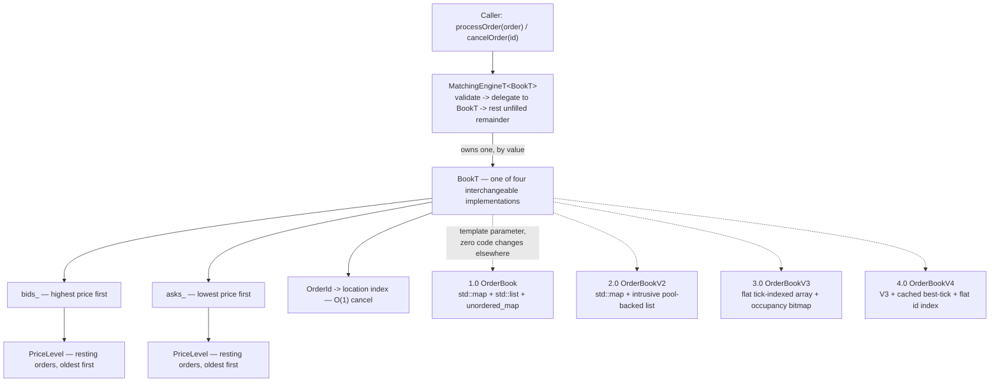

# Ultra Low-Latency Matching Engine

[](https://github.com/kankaniakshat185/low-latency-matching-engine/actions/workflows/ci.yml)

A limit order book and matching engine, built from scratch in C++20 — price-time priority, partial fills, limit and market orders. Single instrument, single thread, by design (see Known Limitations below). The point isn't just that it matches orders correctly; it's that every performance claim in this repo is backed by two things: a differential test proving the faster version is still correct, and real hardware counters, not just a wall-clock number.

## Architecture

Composition over inheritance, all the way down: `MatchingEngine` owns an `OrderBook`, which owns `PriceLevel`s. Nothing is virtual. That's not a style preference — it's what lets the internals (`std::map` vs. a flat array, `std::list` vs. an intrusive pool-backed list) get swapped out and profiled independently, without touching the matching logic itself or any call site above it. `MatchingEngine` is templated on the book type for exactly this reason; see Phase 4 below for what that bought.



## Features

*   Price-time priority matching — limit and market orders, partial fills, strict FIFO within a price level.
*   O(1) cancellation via an `OrderId -> location` index (a hash map in 1.0-3.0, a flat vector in 4.0).
*   Four interchangeable `OrderBook` implementations behind one templated engine, swappable with zero call-site changes (see Phase 4 below).
*   Strict input validation at every external boundary — a duplicate `OrderId`, a zero-quantity order, and every malformed CSV field (negative numbers, trailing garbage, bad Action/Side characters) are rejected loudly, not coerced.
*   Historical CSV replay (`data/sample.csv`) alongside three synthetic benchmark workloads.
*   71 tests: behavioral correctness, adversarial input, a 20,000-op fuzz test checking book invariants after every operation, and differential testing across all four `OrderBook` implementations (byte-identical trade ledgers, including a closing test that runs all four through one shared workload at once). 99.2% line coverage, 100% function coverage.
*   Real hardware-counter evidence (Apple Instruments CPU Counters, `os_signpost`-correlated) behind every Phase 4 performance claim, not just wall-clock numbers.
*   5-job CI pipeline: sanitized debug build, release build, static analysis, formatting check, coverage report — all running on every push.

## Benchmarking

Three synthetic workloads, each isolating a different part of the system: orders scattered across a wide price range, a 70/30 insert/cancel mix, and every order landing at the same price. Every benchmark run does a 10% warm-up pass first (discarded, not timed) to get the instruction cache and branch predictor out of their cold-start state, then measures throughput and per-operation latency in two separate passes — timing both in the same loop was an early bug here (see `optimization_history.md`'s 1.0.1 row) that made the throughput number partly measure its own stopwatch.

`std::chrono`'s own overhead (20-40ns per call, called twice per operation) is a real, acknowledged limit on how much to trust nanosecond-scale numbers from this harness — see `public_docs/benchmarking.md` for the rest of what this methodology does and doesn't account for.

## Baseline Performance (1.0)

The first working version uses `std::map`/`std::list`/`std::unordered_map` throughout — correct and easy to verify, deliberately not optimized yet. These are the numbers before any of Phase 4's data-structure work below.

**Environment**: Apple M2 (ARM64), macOS 26.5.1, `clang++ -O3 -std=c++20`

| Workload (1M Actions) | Throughput | Median Latency | P99 Latency |
| :--- | :--- | :--- | :--- |
| **Random Prices** | ~6.78 M actions/sec | 125 ns | 417 ns |
| **Heavy Cancels** | ~8.73 M actions/sec | 125 ns | 541 ns |
| **Worst-Case** | ~15.73 M actions/sec | 42 ns | 209 ns |

Worst-Case beating Random Prices by more than 2x here is the whole reason Phase 4 exists — it's a strong hint that `std::map`'s tree traversal is costing more than it looks like on paper, and Phase 4 below is what actually went and checked.

## Phase 4: The Comparative Study (done)

Phase 4 replaces the baseline's data structures one variable at a time, verifying correctness against the baseline after each change and benchmarking both wall-clock and (where available) hardware-counter evidence. Full detail is in [`public_docs/optimization_history.md`](public_docs/optimization_history.md) and the [Architecture Decision Log](public_docs/adr/README.md); the short version:

*   **2.0 (done)**: replaced `std::list<Order>`'s per-order heap allocation with an intrusive doubly-linked list backed by a fixed-capacity pool allocator. Price levels unchanged (still `std::map`). **+33–35% throughput** across all three workloads; every hardware bottleneck category improved (Instruments CPU Counters); the Worst-Case/Random-Prices throughput ratio barely moved (1.668 → 1.655) — allocation cost was real but wasn't what explained that persistent gap.
*   **3.0 (done)**: replaced `std::map<Price, PriceLevel>` with a flat, tick-indexed array plus an occupancy bitmap. **+23.7% (Random) and +24.2% (Heavy Cancels)** on top of 2.0 — but a genuine **−10.3% regression on Worst Case**, confirmed at the hardware-counter level, not noise. The mechanism: the array's bitmap scan starts from the edge with no cached "best price," so its cost scales with how far the sole occupied price is from that edge — cheap when many levels are active, expensive when there's exactly one. The standing hypothesis finally moved regardless: the Worst-Case/Random-Prices ratio dropped from ~1.65 to **1.195**. Full mechanism, and the identified-but-not-yet-built fix, in [ADR-0021](public_docs/adr/0021-flat-array-price-levels.md).
*   **4.0 (done)**: cached the best-price tick per side (closes 3.0's regression) and replaced the `OrderId → OrderLocation` cancellation index — a `std::unordered_map` since 1.0 — with a flat vector indexed directly by id. **+122.3% (Random), +97.1% (Heavy Cancels), +100.6% (Worst Case)** on top of 3.0 — every workload roughly doubled, including the one that regressed in 3.0, which is now the single largest relative gain of the three. The Worst-Case/Random-Prices ratio closes further still, to **1.086**. Instruments shows the fix is real: Discarded Bottleneck (branch-misprediction cost) drops sharply everywhere. A second category (Instruction Processing) rises in *percentage* terms everywhere too — resolved, not left hanging: its absolute cost held flat or dropped in every workload, and the percentage only rose because the total cycle count shrank even faster. Full breakdown in [ADR-0022](public_docs/adr/0022-cached-best-tick-and-flat-cancellation-index.md).
*   **Next**: Phase 4's comparative study (1.0 → 4.0) is functionally complete. What's left is closing the loop — a final cross-version summary and interview-prep write-up — not a new numbered version.

All four versions measured back-to-back in one run (the cleanest single comparison — see `optimization_history.md`'s "Final Comparison" for why cross-row numbers elsewhere in this repo aren't directly comparable the same way):

| Workload | 1.0 | 2.0 | 3.0 | 4.0 | Total (1.0→4.0) |
| :--- | :--- | :--- | :--- | :--- | :--- |
| Random Prices | 3.13 M/s | 4.35 M/s | 5.55 M/s | **12.33 M/s** | **+294%** |
| Heavy Cancels | 4.23 M/s | 5.96 M/s | 7.37 M/s | **14.52 M/s** | **+243%** |
| Worst Case | 5.38 M/s | 6.75 M/s | 6.68 M/s | **13.39 M/s** | **+149%** |

## Known Bottlenecks

What's still genuinely limiting this engine's performance, as measured, not guessed at:

*   **Absolute numbers need a clean re-run.** Every Phase 4 number above was measured under real background system load (this is a personal machine, not a dedicated bench). Relative deltas (same process, same run) are trustworthy; absolute throughput/latency figures carry that caveat until re-measured on an idle machine.
*   **`std::chrono` observer overhead.** 20-40ns per call, called twice per operation — up to ~80ns of any measured latency figure may be the timer, not the engine. Worst at the nanosecond scale this project operates at.
*   **No core pinning.** Nothing is pinned to isolated CPU cores, so P99.9/Max latency figures likely include OS scheduling interrupts alongside real algorithmic stalls.
*   **Single-threaded ceiling.** No concurrent order ingestion — throughput is bounded by one core's worth of work, by design (see Non-Goals below).

## Known Limitations & Non-Goals

This is a single-machine, single-instrument, single-threaded matching engine — deliberately, per the project's phased scope (see [Documentation](#documentation) below). If you're evaluating it for anything beyond that scope, these are the boundaries as of the current phase, not oversights:

*   **Single instrument.** `Order`/`Trade` carry no symbol field; one `MatchingEngine` is implicitly one order book.
*   **No self-trade prevention.** Two crossing orders match regardless of where they originated.
*   **No timestamps.** Orders and trades carry no arrival/execution time — the benchmark harness times *itself*, independent of any wall-clock event log.
*   **No persistence, network layer, or risk checks.** This is an in-memory library and a CLI benchmark harness, not a running service.
*   **Single-threaded.** No concurrent order ingestion; every call to `processOrder`/`cancelOrder` is expected to be sequential.

## Testing

71 tests across four files, run on every push (`engine_tests`):

*   **Behavioral correctness** — exact matches, partial fills, price-time priority, cancellation, market-order sweep-and-discard, plus explicit edge cases (empty book, an id that was never inserted, a price level actually erased from the book after it fully drains, not just left empty).
*   **Adversarial input** — 8 CSV-parser cases (negative numbers, malformed rows, bad Action/Side characters, a token with no leading digit at all) and a 20,000-operation fuzz test that deliberately reuses live `OrderId`s and checks the book's invariants after every single operation.
*   **Differential testing across all four `OrderBook` implementations** — the same randomized action sequence (plus a deliberately adversarial all-same-price workload) replayed through each variant, asserting byte-identical trade ledgers against the 1.0 baseline before any performance number is trusted. A closing test runs all four through one shared workload at once.
*   **Direct structural tests** for each variant's own boundary behavior — pool exhaustion, out-of-range price/`OrderId` handling, constructor validation — bypassing `MatchingEngine` entirely, since differential testing alone only ever supplies valid input.

99.2% line coverage, 100% function coverage (`gcovr`, CI `coverage` job).

## Code Quality

*   **Zero concurrency primitives anywhere in the codebase** — no `std::mutex`, `std::thread`, `std::atomic`, or any other locking/threading primitive exists in `src/` or `tests/` (verified by a full-repo grep, not just asserted). This is a single-threaded engine by design, so there is no lock-ordering, no circular-wait, and no deadlock risk to check for — the class of bug doesn't exist here because the primitives that could produce it are absent, not because they were used carefully.
*   **`clang-format`**, blocking in CI — a formatting diff fails the build.
*   **`clang-tidy`**, non-blocking in CI (see [ADR-0012](public_docs/adr/0012-ci-pipeline-design.md) for why it started non-blocking on purpose).
*   **`gcovr`** coverage reporting, not gated on a threshold — a tracked, visible number instead of an unverifiable claim.

## Documentation
The full writeup — architecture, design decisions, and the whole optimization history — lives in [`public_docs/`](public_docs/):

*   [Architecture](public_docs/architecture.md)
*   [Matching Engine](public_docs/matching_engine.md)
*   [Benchmarking Methodology](public_docs/benchmarking.md)
*   [Design Decisions](public_docs/design_decisions.md)
*   [Optimization History](public_docs/optimization_history.md)
*   [Architecture Decision Log](public_docs/adr/README.md) — every decision, major or minor, individually dated
*   [Interview Prep](public_docs/interview_prep.md) — a condensed, talking-points version of Phase 4

There is also a `docs/` directory referenced in some of the writing above (a running "engineering notebook" / learning journal) — it's intentionally gitignored and local-only, not published, so a fresh clone of this repo won't have it. `public_docs/` is the polished, tracked counterpart meant for readers.

## Build Instructions
The project fetches GoogleTest automatically via CMake FetchContent on first build (requires a network connection). The engine and benchmark executables themselves have zero runtime dependencies.

```bash
mkdir build && cd build
cmake ..        # Downloads GoogleTest on first run
make

# Run correctness regression suite
./engine_tests

# Run performance benchmarks (1.0 baseline only — what the numbers above come from)
./engine_benchmark

# Run the Phase 4 comparative study (1.0 vs 2.0 vs 3.0 vs 4.0, side by side)
./variant_benchmark

# Check formatting (from the repo root)
find src tests -name '*.cpp' -o -name '*.h' | xargs clang-format --style=file --dry-run -Werror

# Run static analysis (needs clang-tidy on PATH; CMAKE_EXPORT_COMPILE_COMMANDS=ON)
cmake -B build -DCMAKE_EXPORT_COMPILE_COMMANDS=ON
find src -name '*.cpp' -o -name '*.h' | xargs clang-tidy -p build
```
