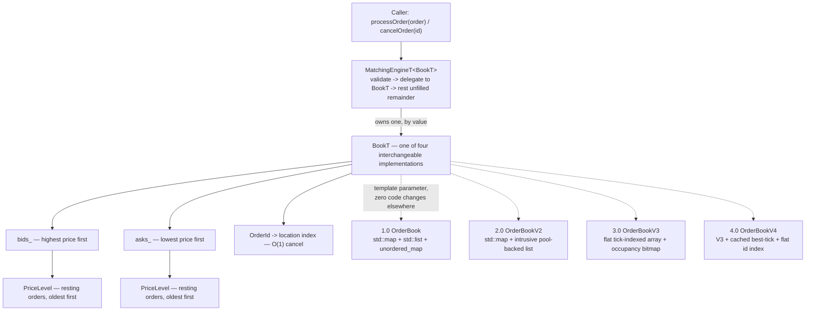

<h1 align="center">Low-Latency Matching Engine</h1>

A limit order book and matching engine built from scratch in C++20 — price-time priority, partial fills, limit and market orders, single instrument, single-threaded by design (see Limitations & Non-Goals below). Every performance claim here is backed by two things: a differential test proving the faster version is still correct, and real hardware counters, not just a wall-clock number.

<p align="center">
  <a href="#features">Features</a> ·
  <a href="#system-architecture">Architecture</a> ·
  <a href="#engineering-decisions-that-mattered">Engineering Decisions</a> ·
  <a href="#the-comparative-study">Results</a> ·
  <a href="#local-development-initialization">Build & Run</a>
</p>

Blog: [Inside a 14.5M Ops/sec C++ Order Book Matching Engine](https://akshatkankani.vercel.app/tech-blog/low-latency-matching-engine)

## Features

*   Price-time priority matching — limit and market orders, partial fills, strict FIFO within a price level.
*   O(1) cancellation via an `OrderId -> location` index (a hash map in 1.0-3.0, a flat vector in 4.0).
*   Four interchangeable `OrderBook` implementations behind one templated engine, swappable with zero call-site changes (see The Comparative Study below).
*   Strict input validation at every external boundary — duplicate `OrderId`s, zero-quantity orders, and malformed CSV fields (negative numbers, trailing garbage, bad Action/Side characters) are all rejected loudly, not coerced.
*   Historical CSV replay (`data/sample.csv`) alongside three synthetic benchmark workloads.
*   71 tests — behavioral correctness, adversarial input, a 20,000-op fuzz test, and differential testing across all four `OrderBook` implementations (byte-identical trade ledgers, plus a closing test running all four at once). 99.2% line coverage, 100% function coverage.
*   Real hardware-counter evidence (Apple Instruments, `os_signpost`-correlated) behind every performance claim below, not just wall-clock numbers.
*   5-job CI pipeline: sanitized debug build, release build, static analysis, formatting check, coverage report — all running on every push.

## System Architecture

Composition over inheritance, all the way down: `MatchingEngine` owns an `OrderBook`, which owns `PriceLevel`s — nothing virtual anywhere. That's what lets the internals (`std::map` vs. a flat array, `std::list` vs. an intrusive pool-backed list) get swapped out and profiled independently, without touching matching logic or any call site above it. `MatchingEngine` is templated on the book type for exactly this reason — see The Comparative Study below.


```mermaid
flowchart TD
    A["Caller: processOrder(order) / cancelOrder(id)"] --> B["MatchingEngineT&lt;BookT&gt;<br/>validate -&gt; delegate to BookT -&gt; rest unfilled remainder"]
    B -->|"owns one, by value"| C["BookT — one of four interchangeable implementations"]
    C --> D["bids_ — highest price first"]
    C --> E["asks_ — lowest price first"]
    C --> F["OrderId -&gt; location index — O(1) cancel"]
    D --> G["PriceLevel — resting orders, oldest first"]
    E --> H["PriceLevel — resting orders, oldest first"]

    C -.->|"template parameter,<br/>zero code changes elsewhere"| I["1.0 OrderBook<br/>std::map + std::list + unordered_map"]
    C -.-> J["2.0 OrderBookV2<br/>std::map + intrusive pool-backed list"]
    C -.-> K["3.0 OrderBookV3<br/>flat tick-indexed array + occupancy bitmap"]
    C -.-> L["4.0 OrderBookV4<br/>V3 + cached best-tick + flat id index"]
```

## Tech Stack

| Layer | Choice |
| :--- | :--- |
| Language | C++20 |
| Build System | CMake, with GoogleTest fetched via `FetchContent` |
| Testing | GoogleTest — 71 tests across `engine_test.cpp`, `replay_test.cpp`, `differential_test.cpp`, `structures_test.cpp` |
| Static Analysis | `clang-tidy` (non-blocking), `clang-format` (blocking) |
| Coverage | `gcovr` — 99.2% line, 100% function, tracked, not gated on a threshold |
| Sanitizers | AddressSanitizer + UndefinedBehaviorSanitizer on every Debug build |
| Profiling | Apple Instruments CPU Counters, correlated via `os_signpost` markers |
| CI | GitHub Actions — 5-job pipeline (sanitized debug build, release build, static analysis, format check, coverage) |

## Engineering Decisions That Mattered

Four decisions from the [Architecture Decision Log](public_docs/adr/README.md) that shaped this project the most, each with what was actually measured, not just argued for.

### 1. Composition Over Inheritance, Not a Style Preference

**Problem**: `OrderBook`'s internals needed to be swappable across four implementations without touching `MatchingEngine` or any caller.

**Approach**: Plain composition, zero virtual functions. A non-virtual call's target is fixed at compile time; a virtual call's isn't — it's read from a per-object vtable at runtime, so the branch predictor has to guess a destination that changes call-to-call, and guesses worse on it. Polymorphic `Order` subclasses would also need to live behind pointers, not by value in `std::list`, since different subclasses are different sizes.

**Result**: A flat, predictable memory layout — and later, `MatchingEngine` became a template (`MatchingEngineT<BookT>`), swapping in four `OrderBook` implementations with zero changes to matching logic.

**Tradeoff**: No way to run two implementations side by side at runtime without a compile-time switch — fine, since the comparative study benchmarks each sequentially. See [ADR-0001](public_docs/adr/0001-composition-over-inheritance.md).

### 2. Differential Testing Before Any Performance Claim Counts

**Problem**: A faster reimplementation that's quietly wrong is worthless, and this project ended up with four independent `OrderBook` implementations to compare.

**Approach**: Replay the same randomized action sequence — plus an adversarial workload where every order lands at one price, exactly where implementations diverge most — through all four, and assert byte-identical trade ledgers.

**Result**: All four passed on the first attempt, including a closing test running all four against one shared workload at once. When 3.0 later regressed on performance, differential testing had already proven it was still correct — just slower, a separate question with a separate answer.

**Tradeoff**: Proves the four implementations agree with each other, not that any one is correct in isolation — it relies on each being independently authored to the same spec, not derived from another's code. See `tests/differential_test.cpp`.

### 3. Shipping a Real Regression, Then Fixing It a Version Later

**Problem**: Replacing `std::map` with a flat, tick-indexed array (3.0) improved two of three workloads by ~24% — but regressed the third by 10.3%.

**Approach**: Root-caused with real hardware performance counters instead of guessing: the array's occupancy-bitmap scan always started from the edge, so its cost scaled with how far the one occupied price was from that edge — cheap with many active levels, expensive with exactly one.

**Result**: Shipped 3.0 with the regression documented plainly instead of quietly patched. A version later (4.0), caching the current best price turned that same −10.3% into **+100.6%** on the identical workload — the biggest reversal of the four, confirmed at the hardware-counter level.

**Tradeoff**: A version that's a strict regression on one axis looks worse in isolation than a silent fix — but the mechanism, and the fix it pointed at, wouldn't have been findable without the honest measurement first. See [ADR-0021](public_docs/adr/0021-flat-array-price-levels.md) and [ADR-0022](public_docs/adr/0022-cached-best-tick-and-flat-cancellation-index.md).

### 4. A Pool Allocator That Fails Loudly Instead of Growing Quietly

**Problem**: `std::list`'s per-order heap allocation meant `malloc`/`free` on every insert and cancel — unpredictable-latency work at exactly the worst moment.

**Approach**: A fixed-capacity slab allocator (`OrderPool`) hands out pre-reserved slots instead of calling `malloc`. Capacity is decided once, up front; exhaustion is a hard, immediate error, never a silent grow.

**Result**: +33–35% throughput across all three workloads — and every hardware bottleneck category improved, not just wall-clock time, consistent with allocation's cache-locality cost rippling through the whole pipeline.

**Tradeoff**: Has to be sized correctly up front. A pool that silently grew when full would reintroduce the exact latency-unpredictability it exists to eliminate — so under-sizing it fails immediately and loudly instead of degrading quietly. See [ADR-0017](public_docs/adr/0017-order-pool-fixed-capacity.md).

## Benchmarking

Three synthetic workloads, each isolating a different part of the system: orders scattered across a wide price range, a 70/30 insert/cancel mix, and every order landing at the same price. Every run does a 10% warm-up pass first (discarded, not timed) to clear the instruction cache and branch predictor's cold-start state, then measures throughput and latency in two separate passes — timing both in one loop was an early bug here (see `optimization_history.md`'s 1.0.1 row) that made throughput partly measure its own stopwatch.

`std::chrono` itself costs 20-40ns per call, called twice per operation — a real, acknowledged limit on how much to trust nanosecond-scale numbers here. See `public_docs/benchmarking.md` for the rest.

## Baseline Performance (1.0)

The first working version uses `std::map`/`std::list`/`std::unordered_map` throughout — correct and easy to verify, deliberately not optimized yet. These are the numbers before any of the data-structure work in The Comparative Study below.

**Environment**: Apple M2 (ARM64), macOS 26.5.1, `clang++ -O3 -std=c++20`. Measured under real background system load, not a dedicated bench — see Bottlenecks below for what that means for these specific numbers.

| Workload (1M Actions) | Throughput | Median Latency | P99 Latency |
| :--- | :--- | :--- | :--- |
| **Random Prices** | ~6.78 M actions/sec | 125 ns | 417 ns |
| **Heavy Cancels** | ~8.73 M actions/sec | 125 ns | 541 ns |
| **Worst-Case** | ~15.73 M actions/sec | 42 ns | 209 ns |

Worst-Case beating Random Prices here is why the comparative study below exists — a strong hint that `std::map`'s tree traversal costs more than it looks like on paper.

## The Comparative Study

The 4 step implementation replaces the baseline's data structures one variable at a time, verifying correctness against the baseline after each change and benchmarking both wall-clock and (where available) hardware-counter evidence. Full detail is in [`public_docs/optimization_history.md`](public_docs/optimization_history.md) and the [Architecture Decision Log](public_docs/adr/README.md); the short version:

*   **2.0**: replaced `std::list<Order>`'s per-order heap allocation with an intrusive doubly-linked list backed by a fixed-capacity pool allocator; price levels unchanged. **+33–35% throughput** across all three workloads, every hardware bottleneck category improved — but the Worst-Case/Random-Prices ratio barely moved (1.668 → 1.655), so allocation cost wasn't what explained that gap.
*   **3.0**: replaced `std::map<Price, PriceLevel>` with a flat, tick-indexed array plus an occupancy bitmap. **+23.7% (Random), +24.2% (Heavy Cancels)** on top of 2.0 — but a genuine **−10.3% regression on Worst Case**, confirmed at the hardware-counter level. Mechanism: the bitmap scan always starts from the array's edge with no cached "best price," so it's cheap when many levels are active and expensive when there's exactly one. The Worst-Case/Random-Prices ratio still dropped to **1.195** — real progress on the standing hypothesis, just not a clean win. Full mechanism in [ADR-0021](public_docs/adr/0021-flat-array-price-levels.md).
*   **4.0**: cached the best-price tick per side (closing 3.0's regression) and replaced the `OrderId → OrderLocation` index — a `std::unordered_map` since 1.0 — with a flat vector indexed directly by id. **+122.3% (Random), +97.1% (Heavy Cancels), +100.6% (Worst Case)** on top of 3.0 — every workload roughly doubled, and Worst Case's reversal is the biggest of the three (Random's +122.3% is the larger gain outright). Ratio closes to **1.086**. Discarded Bottleneck (branch-misprediction cost) drops sharply everywhere; Instruction Processing rises in *percentage* terms, but its absolute cost held flat or dropped — the percentage only rose because total cycles shrank faster. Full breakdown in [ADR-0022](public_docs/adr/0022-cached-best-tick-and-flat-cancellation-index.md).

This comparative study (1.0 → 4.0) is complete — the table below is the final cross-version summary. What's left isn't a new version, it's re-measuring on an idle machine (see Bottlenecks below).

All four versions measured back-to-back in one run — the cleanest single comparison (see `optimization_history.md`'s "Final Comparison" for why numbers elsewhere in this repo aren't directly comparable the same way):

| Workload | 1.0 | 2.0 | 3.0 | 4.0 | Total (1.0→4.0) |
| :--- | :--- | :--- | :--- | :--- | :--- |
| Random Prices | 3.13 M/s | 4.35 M/s | 5.55 M/s | **12.33 M/s** | **+294%** |
| Heavy Cancels | 4.23 M/s | 5.96 M/s | 7.37 M/s | **14.52 M/s** | **+243%** |
| Worst Case | 5.38 M/s | 6.75 M/s | 6.68 M/s | **13.39 M/s** | **+149%** |

## Bottlenecks

What's still genuinely limiting this engine's performance, as measured, not guessed at:

*   **Absolute numbers need a clean re-run.** Every throughput/latency figure in this README — the 1.0 baseline table included — was measured under real background system load on a personal machine, not a dedicated bench. Relative deltas (same process, same run) are trustworthy; absolute figures aren't, until re-measured on an idle machine — a spot re-run of the 1.0 baseline produced roughly half these numbers under heavier load, with the same relative shape between workloads intact.
*   **`std::chrono` observer overhead.** 20-40ns per call, called twice per operation — up to ~80ns of any latency figure may be the timer, not the engine.
*   **No core pinning.** Nothing is pinned to isolated CPU cores, so P99.9/Max latency likely includes OS scheduling interrupts alongside real algorithmic stalls.
*   **Single-threaded ceiling.** No concurrent order ingestion — throughput is bounded by one core's worth of work, by design (see Limitations & Non-Goals below).

## Limitations & Non-Goals

This is a single-machine, single-instrument, single-threaded matching engine, deliberately — these are scope boundaries, not oversights (see Documentation below).

*   **Single instrument.** `Order`/`Trade` carry no symbol field; one `MatchingEngine` is implicitly one order book.
*   **No self-trade prevention.** Two crossing orders match regardless of where they originated.
*   **No timestamps.** Orders and trades carry no arrival/execution time — the benchmark harness times *itself*, independent of any wall-clock event log.
*   **No persistence, network layer, or risk checks.** This is an in-memory library and a CLI benchmark harness, not a running service.
*   **Single-threaded.** No concurrent order ingestion; every call to `processOrder`/`cancelOrder` is expected to be sequential.

## Testing

71 tests across four files, run on every push (`engine_tests`):

*   **Behavioral correctness** — exact matches, partial fills, price-time priority, cancellation, market-order sweep-and-discard, plus edge cases (empty book, a never-inserted id, a price level actually erased after it fully drains, not just left empty).
*   **Adversarial input** — 11 CSV-parser cases (negative numbers, malformed rows, bad characters, missing headers, blank lines) and a 20,000-operation fuzz test that deliberately reuses live `OrderId`s, checking book invariants after every operation.
*   **Differential testing across all four implementations** — byte-identical trade ledgers against the 1.0 baseline before any performance number is trusted, plus a closing test running all four at once (see Engineering Decisions above).
*   **Direct structural tests** for each variant's boundary behavior — pool exhaustion, out-of-range price/`OrderId` handling, constructor validation — since differential testing alone only supplies valid input.

99.2% line coverage, 100% function coverage (`gcovr`, CI `coverage` job).

## Code Quality

*   **Zero concurrency primitives anywhere** — no `std::mutex`, `std::thread`, `std::atomic`, or any locking/threading primitive exists in `src/` or `tests/` (verified by a full-repo grep). Single-threaded by design, so there's no lock-ordering or deadlock risk to check for — the bug class doesn't exist here, not because it was handled carefully.
*   **`clang-format`**, blocking in CI — a formatting diff fails the build.
*   **`clang-tidy`**, non-blocking in CI (see [ADR-0012](public_docs/adr/0012-ci-pipeline-design.md) for why, on purpose).
*   **`gcovr`** coverage reporting, not gated on a threshold — a tracked, visible number instead of an unverifiable claim.

## Local Development Initialization
The project fetches GoogleTest automatically via CMake FetchContent on first build (requires a network connection). The engine and benchmark executables themselves have zero runtime dependencies.

```bash
mkdir build && cd build
cmake ..        # Downloads GoogleTest on first run
make

# Run correctness regression suite
./engine_tests

# Run performance benchmarks (1.0 baseline only — what the numbers above come from)
./engine_benchmark

# Run the comparative study (1.0 vs 2.0 vs 3.0 vs 4.0, side by side)
./variant_benchmark

# Check formatting (from the repo root)
find src tests -name '*.cpp' -o -name '*.h' | xargs clang-format --style=file --dry-run -Werror

# Run static analysis (needs clang-tidy on PATH; CMAKE_EXPORT_COMPILE_COMMANDS=ON)
cmake -B build -DCMAKE_EXPORT_COMPILE_COMMANDS=ON
find src -name '*.cpp' -o -name '*.h' | xargs clang-tidy -p build
```

## Project Structure

```
src/
├── engine/       # The 1.0 baseline: OrderBook, MatchingEngine, PriceLevel, Order, Trade
├── structures/   # OrderBookV2/V3/V4 — the comparative-study implementations, plus the OrderPool allocator
├── benchmark/    # WorkloadGenerator, engine_benchmark's main, and compare_variants.cpp (the comparative-study binary)
├── replay/       # CSVParser — historical order-flow replay
└── utils/        # Timer

tests/            # engine_test.cpp, replay_test.cpp, differential_test.cpp, structures_test.cpp
data/             # sample.csv — a small historical replay fixture
public_docs/      # Architecture, design decisions, optimization history, the ADR log
.github/workflows/  # ci.yml — the 5-job pipeline
```

`MatchingEngine` (in `engine/`) is templated on the book type, so it's the same class instantiated over every implementation in `structures/` — nothing in `engine/` changes to support them.

## Documentation
The full writeup — architecture, design decisions, and the whole optimization history — lives in [`public_docs/`](public_docs/):

*   [Architecture](public_docs/architecture.md)
*   [Matching Engine](public_docs/matching_engine.md)
*   [Benchmarking Methodology](public_docs/benchmarking.md)
*   [Design Decisions](public_docs/design_decisions.md)
*   [Optimization History](public_docs/optimization_history.md)
*   [Architecture Decision Log](public_docs/adr/README.md) — every decision, major or minor, individually dated

There is also a `docs/` directory referenced in some of the writing above (a running "engineering notebook" / learning journal, plus an interview-prep cheat sheet) — it's intentionally gitignored and local-only, not published, so a fresh clone of this repo won't have it. `public_docs/` is the polished, tracked counterpart meant for readers.

## License
MIT License. See `LICENSE` for more information.
